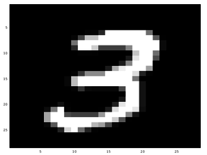
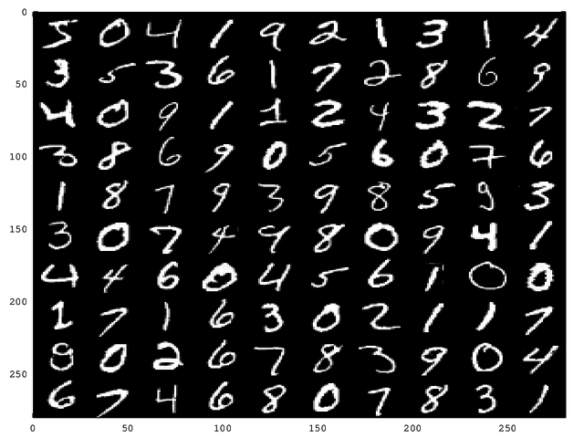

# Create MATLAB / Octave file from MNIST dataset

The MNIST database of handwritten digits (available [here](http://yann.lecun.com/exdb/mnist/)) contains 60,000 examples of handwritten digits for training and 10,000 examples for testing. To use it in MATLAB or Octave the script `mnist.py` creates four matrices and saves them by default in the file `mnist.mat`. This file can be loaded in MATLAB or Octave.

To create the MATLAB file execute the script:

`./mnist.py`

To load the MATLAB file `mnist.mat` in Octave execute Octave and run the following command:

```matlab
octave:1> load('mnist.mat')
octave:2> size(trainingX)
ans =

   60000     784

octave:3> size(trainingY)
ans =

   60000       1

octave:4> size(testingX)
ans =

   10000     784

octave:5> size(testingY)
ans =

   10000       1
```

* `trainingX`: training set, each row contains one example
* `trainingY`: row vector of labels of the training examples
* `testingX`: test set, each row contains one example
* `testingY`: row vector of labels of the testing set

To display the image at row 8 of the training set you can use the following command in Octave:

`colormap(gray()), imagesc(reshape(trainingX(8,:), 28, 28))`

This will display the following image:



## Plotting a set of digits

The Octave function `plotDigits.m` can be used to display a set of digits

`plotDigts(X, 10, 10)` shows 100 digits in 10 rows and 10 columns.



