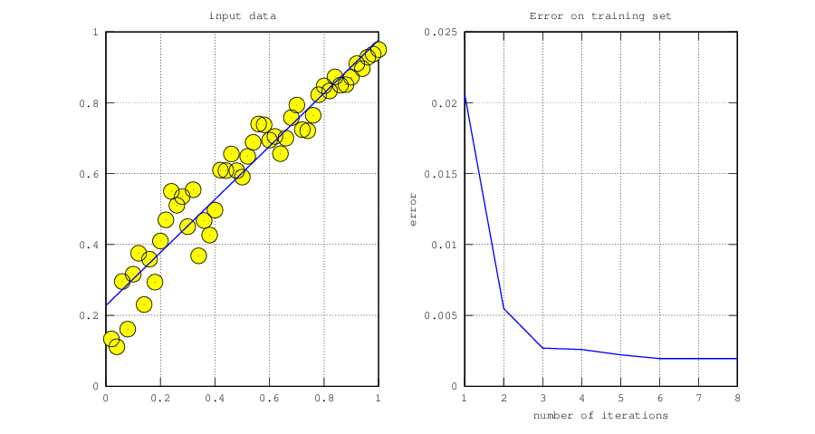
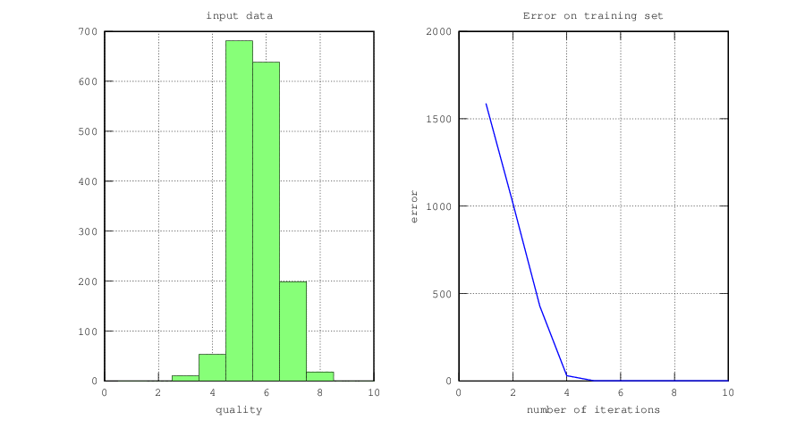

# Examples

**Table of Contents**

- [Recognize handwritten digits with k-nearest neighbour](#recognize-handwritten-digits-with-k-nearest-heighbour)
- [Linear regression](#linear-regression)

## Recognize handwritten digits with k-nearest neighbour

In the file [ex_knn.m](ex_knn.m) you can find an example how to use a k-nearest neighbour classifier to classify handwritten digits of the MNIST dataset. The core of the script is the following line:

`[accuracy, predictions] = testClassifier(@(p) knn(trainingX, trainingY, p, k), X, y);`

Here the function `testClassifier` is used to classify all examples in the matrix `X` with the known target values `y`. The training examples are stored in the matrix `trainingX` and the labels for each training example are stored in the column vector `trainingY`. For each example in the test set the function `testClassifier` calls the function `knn` with the current example (`p`) as the only argument. The parameter `k` is the number of the nearest neighbours in `trainingX` which are used to predict the label of `p`.

## Linear regression

The file [ex_linear_regression.m](ex_linear_regression.m) contains an example how to do linear regression. The core of the script is the following line:

`[theta, fval, cost_history] = linearRegression(X, y)`

It returns:

* `theta`: the learned parameters
* `fval`: cost of the objective function for theta
* `cost_history`: the value of the objective function after each iteration

When a solution was found the script plots the result together with the error on the training set after each iteration.

### Wines

[ex_linear_regression_wine.m](ex_linear_regression_wine.m)

